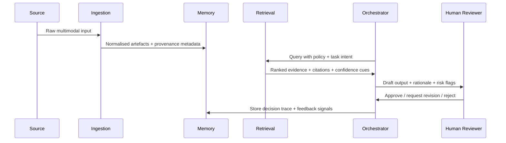

# vai_sante_os

> A privacy-first framework for provenance-aware multimodal memory and orchestration in high-stakes AI workflows.

`vai_sante_os` is an exploratory research infrastructure project. It is **not** a clinical product, not a medical device, and not a decision-maker. The goal is to make it easier to prototype and evaluate AI systems that need to reason over mixed evidence safely, with traceability and human oversight.

## Why this exists

Most AI demos look good on happy-path prompts and fall apart when you ask:

- *Where did this claim come from?*
- *Can I inspect the original evidence?*
- *What changed over time?*
- *How do I review or override this safely?*

This project focuses on those harder questions.

## Problem space

High-stakes workflows (health, legal, policy, safety, operations) often involve:

- multimodal evidence (text, scans, audio, forms, structured records)
- longitudinal context (state changes over weeks or years)
- strict provenance expectations
- privacy constraints and local-first data handling
- human review at critical decisions

`vai_sante_os` explores a generalisable architecture for that setting.

## Core ideas

- **Privacy-first multimodal memory**  
  Keep storage boundaries explicit and minimise data movement.

- **Provenance-aware retrieval**  
  Retrieval returns both content and its chain of custody.

- **Longitudinal reasoning scaffolds**  
  Treat time as first-class, not as stray metadata.

- **Human-in-the-loop orchestration**  
  Route sensitive steps through review gates.

- **Evaluation and governance by default**  
  Assess uncertainty, evidence quality, and failure modes early.

## Architecture overview

### Layered view

```mermaid
flowchart TD
    A[Ingestion Adapters\nPDF | OCR | Audio | Structured Data] --> B[Normalisation & Redaction]
    B --> C[Evidence Store\nObject + Metadata + Access Policy]
    C --> D[Indexing Layer\nEmbeddings | Entity Graph | Temporal Index]
    D --> E[Retrieval Engine\nHybrid + Provenance Constraints]
    E --> F[Reasoning & Orchestration\nAgent Workflows + Tools]
    F --> G[Review Interface\nHuman Approval + Feedback]
    G --> H[Audit & Evaluation\nTrace Logs + Metrics + Replay]
```

### Evidence lifecycle



## Repository structure

```text
.
├── README.md
├── LICENSE
├── .gitignore
├── docs/
│   ├── architecture.md
│   ├── evaluation.md
│   ├── governance.md
│   ├── threat-model.md
│   ├── roadmap.md
│   └── status.md
└── templates/
    ├── eval-scorecard.md
    └── incident-review.md
```

## Safety and evaluation philosophy

- No “black box says so” outputs in high-stakes settings.
- Every material claim should be back-trackable to source evidence.
- Confidence is not enough; uncertainty and missingness should be explicit.
- Human escalation should be cheap and normal, not treated as failure.
- Offline replay should be possible for audits and post-incident learning.

See:

- [`docs/evaluation.md`](docs/evaluation.md)
- [`docs/threat-model.md`](docs/threat-model.md)
- [`docs/governance.md`](docs/governance.md)

## Current project status

This repository is currently a **research showcase scaffold**:

- architecture and operating model documented
- safety, evaluation, and governance artefacts stubbed
- implementation modules intentionally lightweight

It is suitable for:

- design reviews
- portfolio discussion
- exploratory prototyping

It is **not** suitable for direct real-world deployment without substantial engineering, security hardening, and domain validation.

## Naming and positioning

Historically, this architecture started from a healthcare/oncology context. In this repository, it is framed as a **general high-stakes evidence workflow framework**.

## Quick start (documentation-first)

1. Read [`docs/status.md`](docs/status.md)
2. Read [`docs/architecture.md`](docs/architecture.md)
3. Review risk controls in [`docs/threat-model.md`](docs/threat-model.md)
4. Use templates under [`templates/`](templates/) for evaluation and incident reviews

## Licence

Apache License 2.0. See [`LICENSE`](LICENSE).
